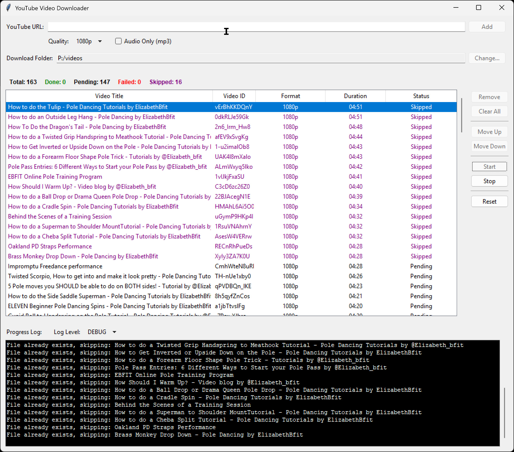

# YouTube Downloader GUI for yt-dl - with mp3 only support

A graphical user interface for downloading YouTube videos and playlists, built with Python's Tkinter library and powered by `yt-dlp`.

## Features

- **Queue Management**: Add multiple YouTube video or playlist URLs to a download queue.
- **Format Selection**: Choose between various video qualities (e.g., 1080p, 720p) or an audio-only MP3 format.
- **Session Persistence**: The application saves your download queue and selected output folder, reloading them automatically on the next launch.
- **Progress Log**: A simple log displays download progress and status messages.
- **Standalone Executable**: Comes with a build script to package the application into a single `.exe` file for Windows.



## Building the Application

[cite_start]The `build.bat` script automates the process of packaging the application into a single executable file[cite: 2].

### Requirements

Before building, you must install the necessary dependencies.

1.  [cite_start]**Python**: Must be installed and added to your system's PATH environment variable[cite: 3].
    -   Download from: `https://www.python.org/downloads/`

2.  **PyInstaller**: A Python package used to convert Python scripts into standalone executables.
    -   Install via pip in your terminal:
        ```
        pip install pyinstaller
        ```
    -   [cite_start]This is a required package for the build script to function[cite: 3].

3.  **FFmpeg**: (Optional but Recommended) A multimedia framework required for merging video and audio streams (for high-quality downloads) and for converting to MP3.
    -   Download from: `https://ffmpeg.org/download.html`
    -   [cite_start]After downloading, place `ffmpeg.exe` in the same directory as the project files[cite: 5]. The build script will automatically detect and bundle it into the final executable.

### Build Steps

1.  [cite_start]Ensure `youtube_downloader.py` is in the current directory[cite: 4].
2.  Place the optional `ffmpeg.exe` in the directory if you have it.
3.  Double-click and run the `build.bat` file.
4.  The script will invoke PyInstaller with the correct parameters to build the application.
5.  Upon completion, look for `yd.exe` inside the newly created `dist` subdirectory. This is your standalone application.

if __name__ == '__main__':
    # You can run this file to print the README content to the console.
    print(readme_content)
